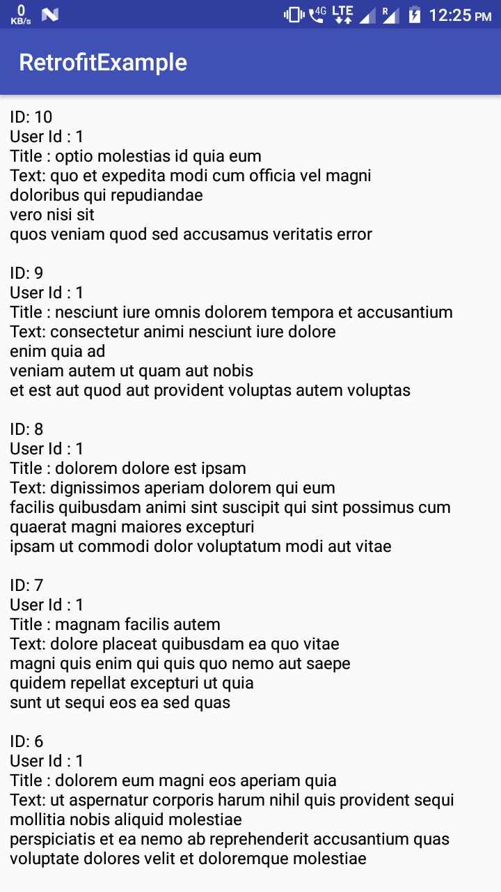

# RetrofitExample
# This is simple Android Application for getting basic understanding of Reterofit.
# It fetches fake data from https://jsonplaceholder.typicode.com/
MainActivity.java contains several functions such as getPosts(), getComments(), createPost(), updatePost(), deletePost(). Run any functions and make other functions comment, to fetch data from the server.

Screenshot of getPost() method that fetches all the post with UserId 1.

